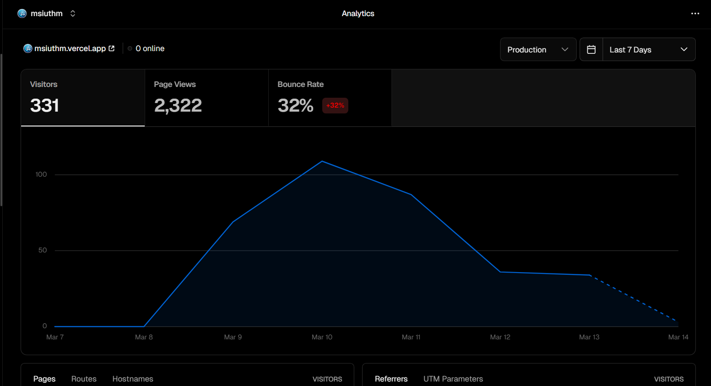
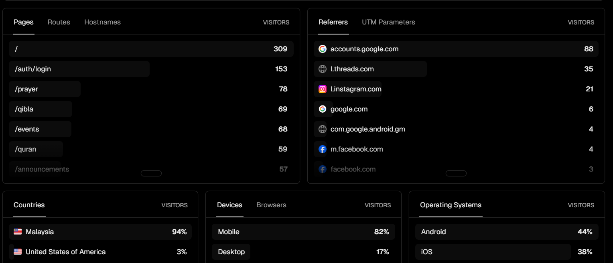
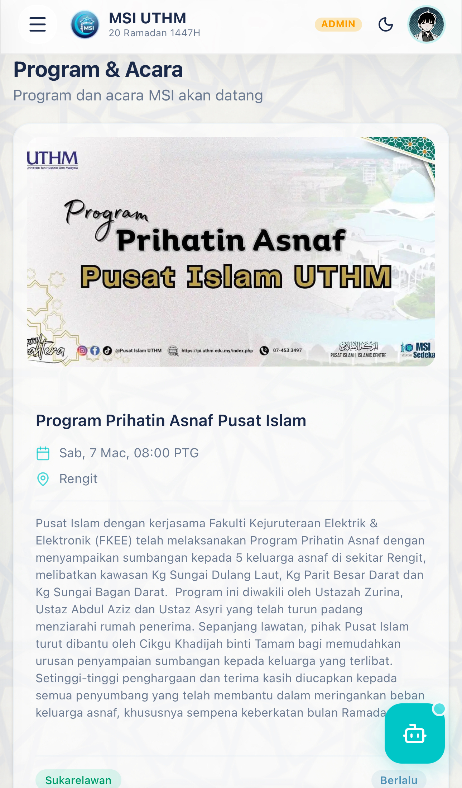
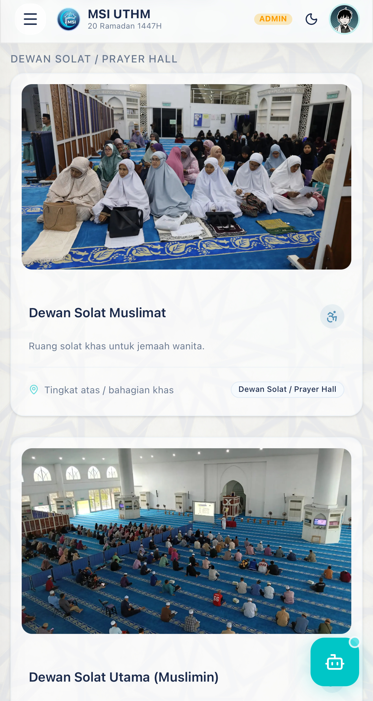
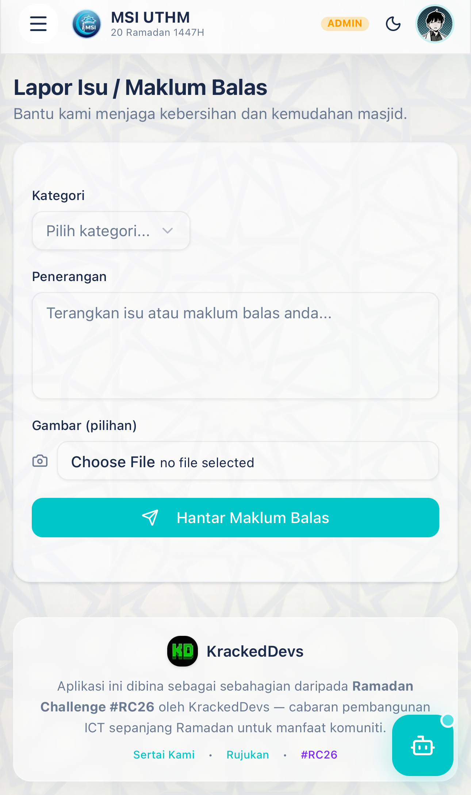
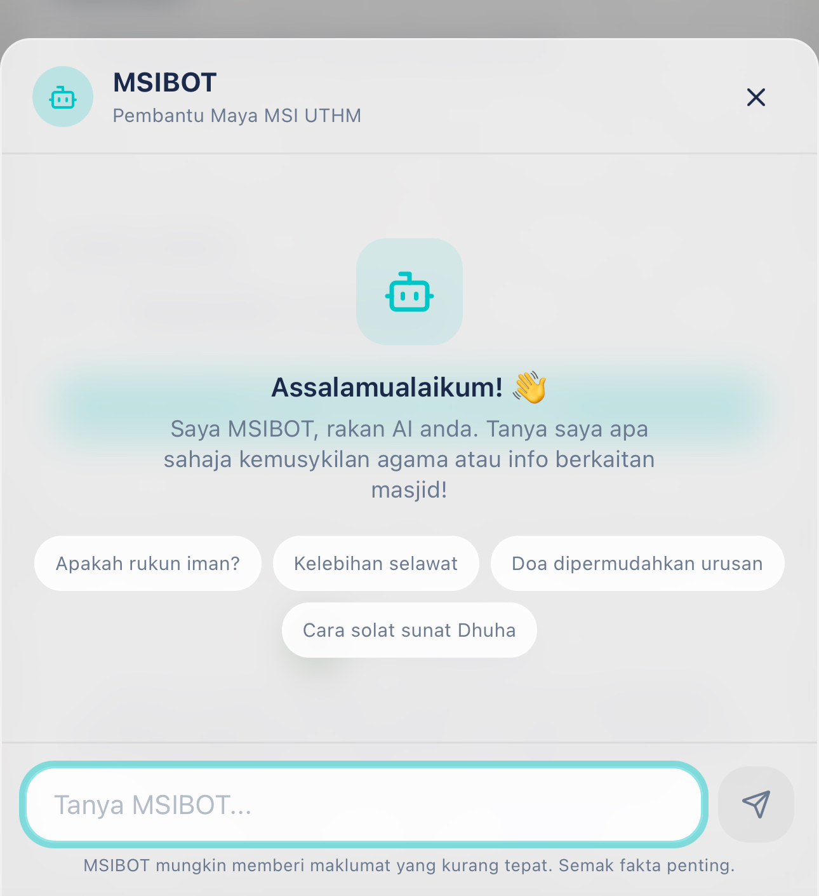
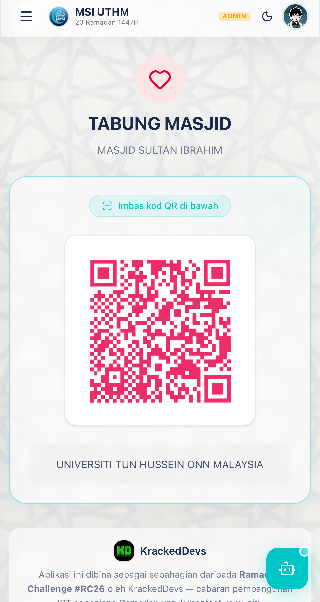

# MSI UTHM Companion Web App 🕌

Welcome to the **MSI UTHM Companion** repository! This is a modern, community-focused web application built for **Masjid Sultan Ibrahim (MSI)** at Universiti Tun Hussein Onn Malaysia (UTHM).

## 🌟 Why This Was Built

The **MSI UTHM Companion** was created to bridge the gap between the mosque administration and the local community, especially the students. Traditionally, information about prayer times, upcoming events, and mosque facilities was scattered or difficult to access.

This central hub aims to:
- Provide accurate, location-based prayer times and Iqamah countdowns.
- Digitize the management of mosque programs, facilities, and volunteer efforts.
- Make it easier for the community to contribute (Infaq) and provide feedback.
- Serve as a blueprint for modernizing mosque management systems everywhere.

---
## USER GROWTH (ANALYTICS)


---

## ✨ Key Features

<table>
<div style="width: 100%;">

  <!-- Item 1 -->
  <div style="margin-bottom: 30px; text-align: center;">
    
    <h3>Vercel Analytics</h3>
    <p>

    </p>
  </div>

  <!-- Item 2 -->
  <div style="text-align: center;">
    
    <h3>Tiktok Analytics</h3>
    <p>
      View mosque announcements, prayer schedules, and important updates
      directly within the application.
    </p>
  </div>

</div>
</table>

<table>
  <tr>
    <td width="50%" valign="top">
      <h3>🕌 Program & Aktiviti (Events & Activities)</h3>
      <ul>
        <li>Browse upcoming mosque events with beautiful poster images.</li>
        <li>RSVP to events directly through the app.</li>
        <li>"Add to Calendar" functionality for easy scheduling.</li>
      </ul>
    </td>
    <td width="50%" valign="top">
      
    </td>
  </tr>
</table>

<table>
  <tr>
    <td width="50%" valign="top">
      <h3>🏢 Kemudahan (Facilities)</h3>
      <ul>
        <li>Explore available mosque facilities (halls, meeting rooms, etc.).</li>
        <li>View facility images, descriptions, and wheelchair accessibility status.</li>
      </ul>
    </td>
    <td width="50%" valign="top">
      
    </td>
  </tr>
</table>

<table>
  <tr>
    <td width="50%" valign="top">
      <h3>💡 Maklum Balas (Feedback & Reporting)</h3>
      <ul>
        <li>Users can report issues (e.g., broken pipes, lighting problems) with photos.</li>
        <li>Track the status of reports as admins acknowledge and resolve them.</li>
      </ul>
      <br>
      <h3>🤖 Pembantu Maya MSIBot (AI Chatbot)</h3>
      <ul>
        <li>Integrated AI chatbot (MSIBot) to answer general Islamic questions and provide information about the mosque.</li>
      </ul>
    </td>
    <td width="50%" valign="top">
      
      
    </td>
  </tr>
</table>

<table>
  <tr>
    <td width="50%" valign="top">
      <h3>💖 Infaq & Sumbangan (Donations)</h3>
      <ul>
        <li>Easy access to the mosque's DuitNow QR codes and bank details.</li>
        <li>Seamless, secure way for the community to contribute financially.</li>
      </ul>
    </td>
    <td width="50%" valign="top">
      
    </td>
  </tr>
</table>


---

## 🛠️ Technology Stack

- **Framework:** [Next.js 15](https://nextjs.org/) (App Router)
- **Styling:** [Tailwind CSS](https://tailwindcss.com/) with a custom Glassmorphism aesthetic
- **Database & Auth:** [Supabase](https://supabase.com/) (PostgreSQL, Row Level Security, Storage)
- **Icons:** [Lucide React](https://lucide.dev/)
- **Deployment:** Vercel

---

## 🚀 Getting Started Locally

### Prerequisites
1. Node.js 18+ installed
2. A Supabase project

### Installation

1. Clone the repository:
   ```bash
   git clone https://github.com/hzqfarhan/MSIUTHM.git
   cd MSIUTHM
   ```

2. Install dependencies:
   ```bash
   npm install
   ```

3. Setup environment variables:  
   Copy `.env.local.example` to `.env.local` and add your Supabase credentials:
   ```env
   NEXT_PUBLIC_SUPABASE_URL=your_supabase_url
   NEXT_PUBLIC_SUPABASE_ANON_KEY=your_supabase_anon_key
   ```

4. Run the development server:
   ```bash
   npm run dev
   ```

5. Open [http://localhost:3000](http://localhost:3000) with your browser to see the result.

---

## 📝 License

This project is intended for the community use of Masjid Sultan Ibrahim UTHM. Reach out to the repository owner for licensing queries.
