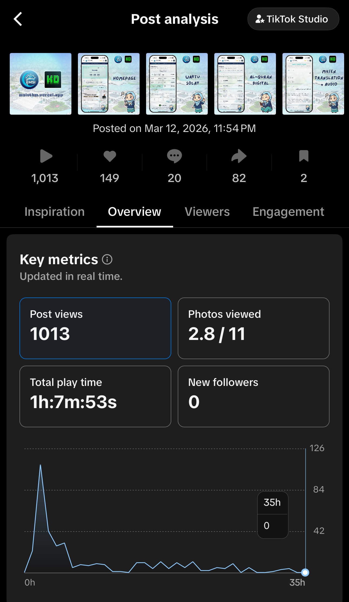
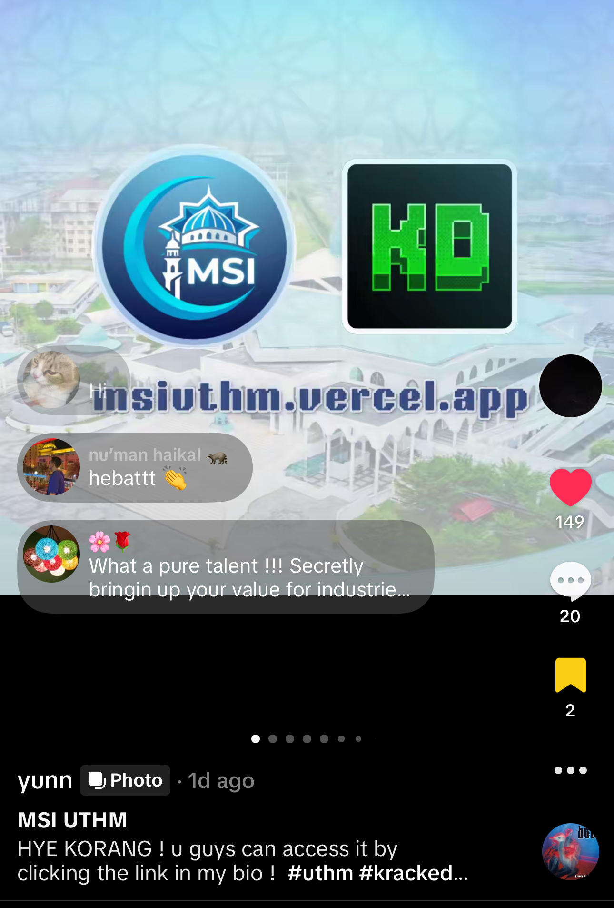

# MSI UTHM Companion Web App 🕌

Welcome to the **MSI UTHM Companion** repository! This is a modern, community-focused web application built for **Masjid Sultan Ibrahim (MSI)** at Universiti Tun Hussein Onn Malaysia (UTHM).

## 🌟 Why This Was Built

The **MSI UTHM Companion** was created to bridge the gap between the mosque administration and the local community, especially the students. Traditionally, information about prayer times, upcoming events, and mosque facilities was scattered or difficult to access.

This central hub aims to:
- Provide accurate, location-based prayer times and Iqamah countdowns.
- Digitize the management of mosque programs, facilities, and volunteer efforts.
- Make it easier for the community to contribute (Infaq) and provide feedback.
- Serve as a blueprint for modernizing mosque management systems everywhere.

---

## USER GROWTH (ANALYTICS)

<h3 align="center">Vercel Analytics</h3>

<div align="center">
  
  <br><br>
  <a href="https://vt.tiktok.com/ZSuPF47Jx/" target="_blank" rel="noopener noreferrer">
    
  </a>
</div>


<br>

<h3 align="center">TikTok Analytics</h3>

<table>
  <tr>
    <td width="50%" align="center">
      
    </td>
    <td width="50%" align="center">
      
    </td>
  </tr>
</table>


---

## ✨ Key Features

<table>
  <tr>
    <td width="50%" valign="top">
      <h3>🕌 Program & Aktiviti (Events & Activities)</h3>
      <ul>
        <li>Browse upcoming mosque events with beautiful poster images.</li>
        <li>RSVP to events directly through the app.</li>
        <li>"Add to Calendar" functionality for easy scheduling.</li>
      </ul>
    </td>
    <td width="50%" valign="top">
      
    </td>
  </tr>
</table>

<table>
  <tr>
    <td width="50%" valign="top">
      <h3>🏢 Kemudahan (Facilities)</h3>
      <ul>
        <li>Explore available mosque facilities (halls, meeting rooms, etc.).</li>
        <li>View facility images, descriptions, and wheelchair accessibility status.</li>
      </ul>
    </td>
    <td width="50%" valign="top">
      
    </td>
  </tr>
</table>

<table>
  <tr>
    <td width="50%" valign="top">
      <h3>💡 Maklum Balas (Feedback & Reporting)</h3>
      <ul>
        <li>Users can report issues (e.g., broken pipes, lighting problems) with photos.</li>
        <li>Track the status of reports as admins acknowledge and resolve them.</li>
      </ul>
      <br>
      <h3>🤖 Pembantu Maya MSIBot (AI Chatbot)</h3>
      <ul>
        <li>Integrated AI chatbot (MSIBot) to answer general Islamic questions and provide information about the mosque.</li>
      </ul>
    </td>
    <td width="50%" valign="top">
      
      
    </td>
  </tr>
</table>

<table>
  <tr>
    <td width="50%" valign="top">
      <h3>💖 Infaq & Sumbangan (Donations)</h3>
      <ul>
        <li>Easy access to the mosque's DuitNow QR codes and bank details.</li>
        <li>Seamless, secure way for the community to contribute financially.</li>
      </ul>
    </td>
    <td width="50%" valign="top">
      
    </td>
  </tr>
</table>

---

## 🛠️ Technology Stack

- **Framework:** [Next.js 15](https://nextjs.org/) (App Router)
- **Styling:** [Tailwind CSS](https://tailwindcss.com/) with a custom Glassmorphism aesthetic
- **Database & Auth:** [Supabase](https://supabase.com/) (PostgreSQL, Row Level Security, Storage)
- **Icons:** [Lucide React](https://lucide.dev/)
- **Deployment:** Vercel

---

## 🚀 Getting Started Locally

### Prerequisites
1. Node.js 18+ installed
2. A Supabase project

### Installation

1. Clone the repository:
   ```bash
   git clone https://github.com/hzqfarhan/MSIUTHM.git
   cd MSIUTHM
